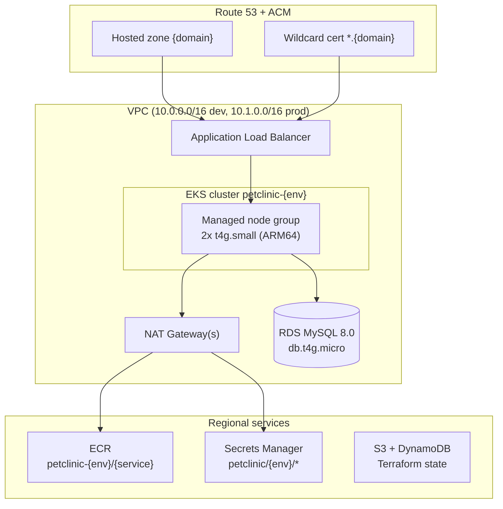
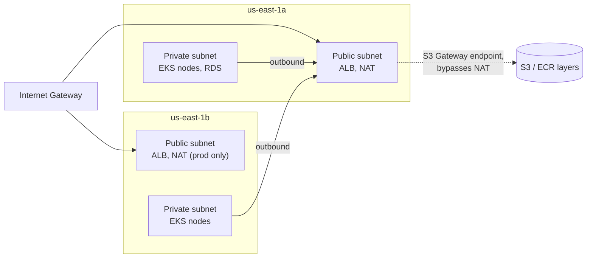
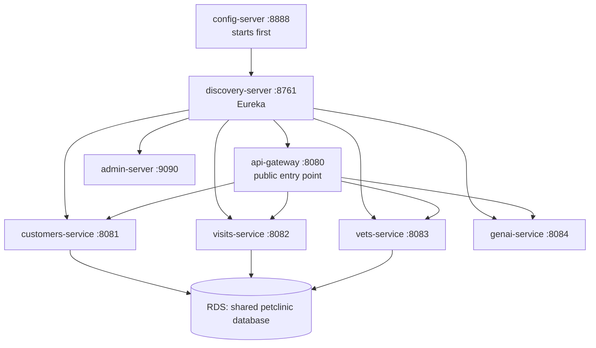
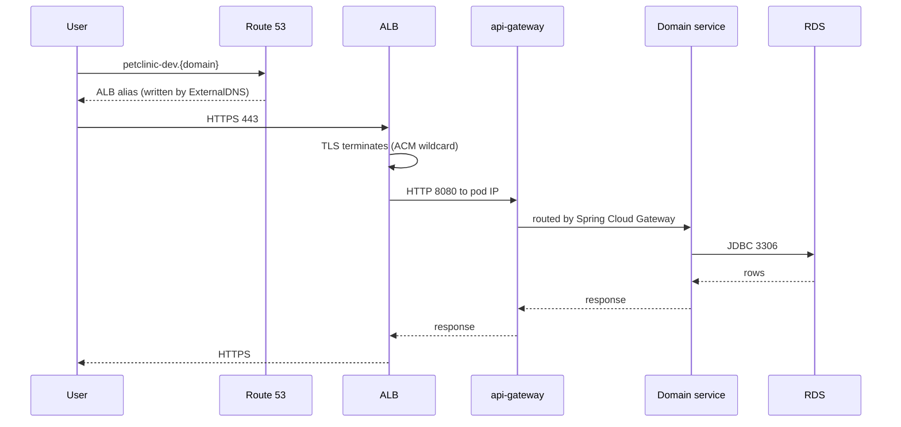
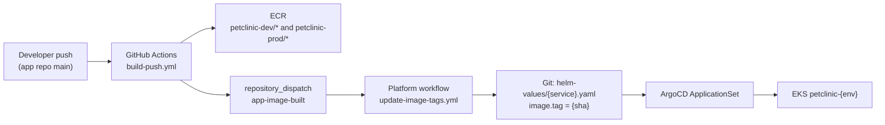

# Petclinic Platform Architecture

**Last Updated:** 2026-09-02

Infrastructure for running Spring Petclinic Microservices on AWS EKS. This document
covers the shape of the platform and how a request travels through it. Exact ports,
quotas, chart versions, and costs live in [`technical-spec.md`](./technical-spec.md) —
they are linked, not repeated.

## Contents

- [Scope](#scope)
- [AWS resources](#aws-resources)
- [Network layout](#network-layout)
- [Service topology](#service-topology)
- [Request path](#request-path)
- [How code reaches the cluster](#how-code-reaches-the-cluster)
- [What Terraform installs directly](#what-terraform-installs-directly)
- [Environment differences](#environment-differences)
- [Cost](#cost)
- [Technology choices](#technology-choices)

## Scope

Two environments, `dev` and `prod`, in one AWS account in `us-east-1`. Each is a
separate Terraform state and a separate EKS cluster. The application source lives in a
different repository (`spring-petclinic-microservices`) and is read-only from here —
this repo owns infrastructure, packaging, and delivery.

Placeholders used throughout: `{domain}` is the operator's public domain, `{account}`
is the AWS account ID, `{env}` is `dev` or `prod`.

## AWS resources

Terraform modules that build these: `terraform/modules/{vpc,eks,ecr,rds,secrets,dns,observability,github-oidc}/`.
Each environment composes them from `terraform/environments/{env}/main.tf`.

## Network layout

Public subnets hold only the edge. Everything that runs workloads or stores data sits
in private subnets with no public IP. See [ADR-0001](./adr/0001-network-layout.md).

Dev runs one NAT Gateway; prod runs one per AZ so a zone failure cannot cut outbound
traffic for the other. The S3 Gateway endpoint is free and keeps image-layer pulls off
NAT. CIDRs and subnet tags: [spec § VPC Network Design](./technical-spec.md#vpc-network-design).

Four security groups form the perimeter — ALB, EKS cluster, EKS node, RDS. The only
`0.0.0.0/0` ingress in the platform is the ALB on 80 and 443. RDS accepts 3306 from the
node security group only. See [spec § Security Groups](./technical-spec.md#security-groups).

## Service topology

Eight Spring Boot services in namespace `petclinic-{env}`. Three of them hold data.

Startup order is enforced by init containers: config-server has none, discovery-server
waits for config-server, everything else waits for both. Ports and Spring profiles:
[spec § Application Services](./technical-spec.md#application-services).

All three data services share one `petclinic` database because the app's schema has
foreign keys across service boundaries — see [ADR-0003](./adr/0003-shared-rds.md).

## Request path

The ALB uses `target-type: ip`, so packets arrive at pods directly from ALB ENIs in the
VPC rather than through a node port. That is why the api-gateway NetworkPolicy allows
the VPC CIDR rather than a namespace.

Only customers, visits, and vets reach RDS. The gateway holds no data, and genai-service
talks to the OpenAI API outbound through NAT.

## How code reaches the cluster

CI builds and pushes; ArgoCD deploys. GitHub Actions never runs `kubectl` or `helm`.

The same commit SHA is pushed under both ECR prefixes, so one `image.tag` works in both
environments — only `image.registry` differs between `helm-values/dev.yaml` and
`prod.yaml`. Dev auto-syncs; prod waits for a manual sync. See
[ADR-0008](./adr/0008-argocd-gitops.md) and [spec § GitOps with ArgoCD](./technical-spec.md#gitops-with-argocd).

## What Terraform installs directly

ArgoCD deploys the eight application services. Cluster add-ons are Terraform
`helm_release`, not ArgoCD Applications — they must exist before or independently of
the app layer, and several of them are what ArgoCD depends on.

| Component | Namespace | Installed by |
|-----------|-----------|--------------|
| External Secrets Operator | `external-secrets` | Terraform (`modules/secrets`) |
| AWS Load Balancer Controller | `kube-system` | Terraform (`modules/dns`) |
| ExternalDNS | `kube-system` | Terraform (`modules/dns`) |
| EBS CSI driver, CoreDNS, kube-proxy, VPC CNI | `kube-system` | Terraform EKS add-ons (`modules/eks`) |
| kube-prometheus-stack, Loki, Fluent Bit | `monitoring` | Terraform (`modules/observability`) |
| Zipkin | `tracing` | Terraform (`modules/observability`) |
| ArgoCD itself | `argocd` | Operator, `kubectl apply -k k8s/argocd/install/` |
| The 8 Spring services | `petclinic-{env}` | ArgoCD |

Each add-on release is gated by an install flag (`install_eso`, `install_lb_controller`,
`install_external_dns`, `install_observability`, `install_ebs_csi`) that is only true
once that environment's cluster exists, so a root module with no cluster still plans.

Secrets never appear in Git: AWS Secrets Manager holds the values, External Secrets
Operator syncs them into Kubernetes Secrets via the CRs in
`k8s/base/external-secrets/`. See [ADR-0011](./adr/0011-secrets-manager.md).

## Environment differences

Both environments run the same modules with different inputs. The differences are
tabulated in the spec rather than duplicated here:

- Replica counts, HPA, and PDB — [spec § Kubernetes Overlays](./technical-spec.md#kubernetes-overlays)
- NAT count (1 dev / 2 prod) — [spec § VPC Network Design](./technical-spec.md#vpc-network-design)
- ECR tag mutability (MUTABLE dev / IMMUTABLE prod) — [spec § ECR Container Registry](./technical-spec.md#ecr-container-registry)
- Prometheus and Loki retention and PVC sizes — [spec § Observability](./technical-spec.md#observability)
- Resource quotas — [spec § Security Controls](./technical-spec.md#security-controls)

Two differences worth stating outright because they change how you work:

- **Dev auto-syncs, prod does not.** A merged image tag lands in dev by itself; prod
  requires a deliberate sync.
- **The wildcard certificate is issued once.** Dev issues `*.{domain}`; prod looks it
  up. Applying prod before dev has issued it will fail the lookup.

## Cost

Roughly $113/month for dev and $145/month for prod, dominated by the EKS control plane
(~$73 each, unavoidable) and NAT Gateways. Full breakdown:
[spec § Scaling and Cost](./technical-spec.md#scaling-and-cost).

The control plane and NAT bill continuously whether or not anything is deployed.
`scripts/stop-env.sh` scales nodes down and stops RDS between sessions but does not
touch either of those.

Karpenter would improve node-level cost efficiency. It is designed
([ADR-0009](./adr/0009-karpenter.md)) but **not built** — E-14 is unimplemented, and
nodes today are a fixed managed node group.

## Technology choices

Each decision has an ADR; the reasoning is there rather than here.

| Area | Decision | ADR |
|------|----------|-----|
| Network | Public edge, private compute and data | [0001](./adr/0001-network-layout.md) |
| Orchestrator | EKS rather than ECS | [0002](./adr/0002-eks-over-ecs.md) |
| Database | One shared RDS instance | [0003](./adr/0003-shared-rds.md) |
| Packaging | Helm (superseded plain YAML) | [0007](./adr/0007-helm-over-plain-yaml.md), [0004](./adr/0004-plain-yaml-over-helm.md) |
| CI auth | GitHub Actions OIDC, no static keys | [0005](./adr/0005-github-actions-oidc.md) |
| RDS topology | Single-AZ | [0006](./adr/0006-single-az-rds.md) |
| Delivery | ArgoCD GitOps | [0008](./adr/0008-argocd-gitops.md) |
| Node scaling | Karpenter (planned) | [0009](./adr/0009-karpenter.md) |
| Registry | Private ECR | [0010](./adr/0010-ecr-private.md) |
| Secrets | AWS Secrets Manager + ESO | [0011](./adr/0011-secrets-manager.md) |
| DNS records | ExternalDNS writes the ALB alias | [0012](./adr/0012-externaldns.md) |
| Logs | Loki in-cluster, not CloudWatch | [0013](./adr/0013-loki-over-cloudwatch.md) |

## Related documents

- [Runbook](./runbook.md) — day-2 procedures
- [Incident playbook](./incident-playbook.md) — when something breaks
- [Monitoring guide](./monitoring-guide.md) — what to look at
- [DR plan](./dr-plan.md) — rebuild from nothing
- [Onboarding](./onboarding.md) — first 90 minutes
